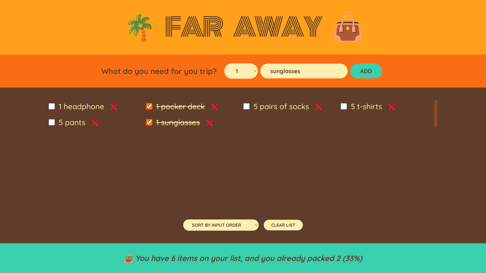

# Far Away

A web application to plan and organize your bags for your trips

## About

This is one of the projects that I developed during my enrollment in the Jonas Schmedtmann's [React course](https://www.udemy.com/course/the-ultimate-react-course/). As custom features, I added:

- User session recording in the browser;
- A different and more scalable approach on state management, using contexts and reducers;
- Unit tests;

With this project, I could learn about

- State managment in React, using hooks like `useState` and `useReducer`;
- How to use contexts and reducers to avoid prop drilling and centralize state managment for scalability;
- Advanced unit testing practices with Vitest, like mocking of contexts, timers and user interactions

## Dependencies

Node: `v19.3.0`

## How to run locally

After downloading the source code, run

    npm install
    npm run dev

and to execute the test suites, run

    npm run test
